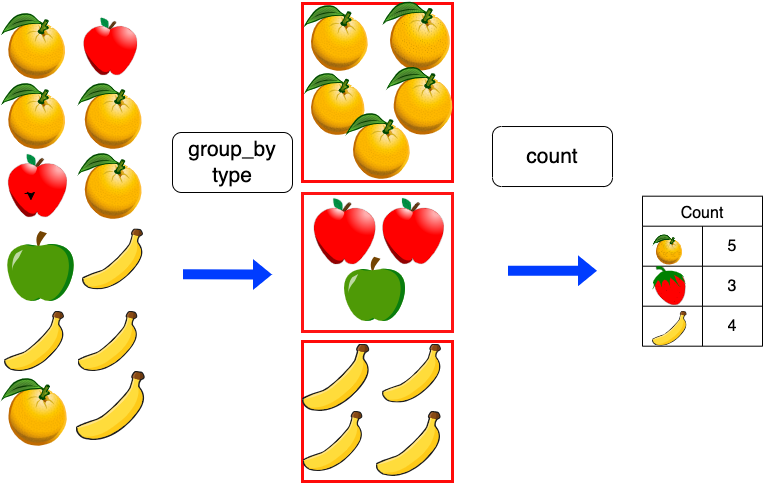
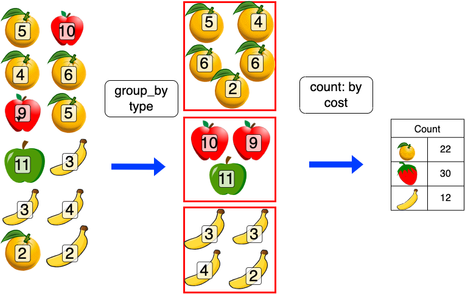

## Class Objectives

This week, we're going to get used to the environment we'll use for creating the visualisations for this course. By the end of today, you should be comfortable with the interface, and able to use R, load packages, and do some basic manipulations of dataframes.

### What if I get stuck?

It's OK! Take your orange post-it, and place it on the back of your computer. I'll come around to help as soon as possible.

If you've finished everything, put up your green post-it. I'll give you some advanced exercises to complete.

## Load R Studio using Posit cloud

As last week, we'll open R using Posit cloud. Use the sidebar to switch to the 'Information Visualisation and the Humanities' Workspace, and click on the new assignment, for week 2, called 'Week 2: Introduction to R':

{width="800"}

You'll see an existing .Rmd file in the file manager in the bottom right. This is a 'live' version of this book chapter. It contains code cells and text. The first part of this practical session simply involves running these cells in the correct order, and looking at the output.

You should now switch to reading this in the .Rmd file in Posit studio. I'll explain and demonstrate each cell, and then you can run them for yourself.

Following that, you'll create your own new markdown notebook, and practice some of the techniques we've learned- and submit it to Brightspace as a weekly task.

## Open the .Rmd file

To begin, click on the .Rmd file. It will open in the reading pane in the top-left. The .Rmd file is an identical copy of this chapter, except you can see the 'source', and can change and run the code directly.

If asked to install packages, go ahead and install them. It might take a few moments to complete.

You can switch between two views - again as we saw last week. Either 'Source' or 'Visual'. In the 'Source' view, you'll see the source markdown code used to write the document. The 'Visual' view will show the page as it would look when finished, including the images.

As we learned in the previous week, .Rmd files contain 'regular' text, as well as code cells - these are shaded boxes with `{r}` in the left corner. On the right corner, they have a number of icons. Clicking the small green triangle icon will 'run' the cell, meaning any code in it will be executed and the output, if any, will be displayed underneath.

Let's try this here. Click on the green triangle to the right of the shaded code cell below this text:

```{r}
print("Hello World")
```

The code (which simply tells R to print the message "Hello World" should run, and the result should appear below.

## R code

R code, as most programming languages, involves manipulating data. Data is usually stored as **variables** and the manipulations are usually done by applying these variables to **functions.** Often, programmers will write their own functions, but in this course, we'll exclusively use existing functions, from various packages.

## Installing and loading packages

Before we begin, an important part of using R is knowing how to install and load packages. Packages are bundles of pre-made functions, usually with a specific task in mind, such as the `sf` package for geospatial analysis, or the `dplyr` package for data wrangling. Many times when using R you will use these packages.

In order to be able to use them, they need to first be installed, and second they need to be loaded.

To install a new package, use the code `install.packages()` with the package name inside, in quotation marks. For example to install the `palmerpenguins` package:

```{r}
#| eval: false


install.packages('palmerpenguins')

```

## Loading existing packages

Once you have installed a package, you have to tell R that it should load the functions from the package into the 'session', so you can use them. Do this using the command `library()`. To load the `tidyverse` package, which we'll use in this tutorial, run the following cell:

```{r}
library(tidyverse)
```

Note that now, the package name does not need to be in quotation marks.

### 'Base' R.

Commands using R without needing any additional packages are often called 'base' R. Here are some important ones to know:

You can assign a value to an object using `=` or `<-`:

```{r}

x = 1

y <- 4

```

Entering the name of a variable in the console and pressing return will return that value in the console. The same will happen if you enter it in a notebook cell (like here below), and run the cell. This is also true of any R object, such as a dataframe, vector, or list.

```{r}
y
```

You can do basic calculations with `+`, `-`, `*` and `/`.

The code below creates a variable `x`, which is the result of the calculation `1 + 1`, a variable y, which is the result of the calculation `4 - 2`, and a variable `z`, which is the result of multiplying `x` by `y`. Finally, we print the output of `z`.

```{r}
x = 1 + 1

y = 4 - 2

z = x * y

z
```

#### Comparisons

You can compare numbers or variables using `==` (equals), `>` (greater than), `<`, (less than) `!=` (not equal to). These return either `TRUE` or `FALSE`, which you'll see if you run this cell:

```{r}

1 == 1

x > y

x != z

```

### Basic R data structures

It is worth understanding the main types of data that you'll come across, in your environment window (top-right pane).

A **variable** is a piece of data stored with a name, which can then be used for various purposes. It's called a variable because we can change it and re-run the same code. The simplest of these are single **elements**, such as a number:

```{r}

x = 1

x
```

Next is a vector. A vector is a list of **elements**. A vector is created with the command `c()`, with each item in the vector placed between the brackets, and followed by a comma. If your vector is a vector of words, the words need to be in inverted commas or quotation marks.

```{r}

piece = c(1,2,3,4,5,6,7,8,9,10,11,12)
fruit = c("oranges", "apples", "oranges", "oranges", "apples", "oranges", "apples", "bananas", "bananas", "bananas", "oranges", "bananas")
colour = c("orange", "red", "orange", "orange", "red", "orange", "green", "yellow", "yellow", "yellow", "orange", "yellow")
cost = c(5,10,4,6,9,5,11,3,3,4,2,2)
cost_last_week = c(7,12,6,8,11,7,13,5,5,6,4,4)
```

Next are dataframes. These are the spreadsheet-like objects, with rows and columns, which you'll use in most analyses.

You can create a dataframe using the `data.frame()` command. You just need to pass the function each of your vectors, which will become your columns. Don't worry about the code `kableExtra::kbl()` for now: it simply prints the table in a way which makes it very clear.

```{r}
fruit_data = data.frame(fruit, colour, cost,cost_last_week, stringsAsFactors = FALSE)

fruit_data %>% kableExtra::kbl()
```

We can also use the `glimpse()` or `str()` commands to view some basic information on the dataframe (particularly useful with longer data).

```{r}
glimpse(fruit_data)
```

### Environment

Every time we create an object like this, it will appear within RStudio's environment. This means it has been saved in memory as an object which can be used for other purposes. When we close RStudio, the environment disappears.

You can see the objects in the environment in the top-right corner (the screenshot below will only show in the book version):

{width="600"}

Here you'll see everything we've created, and a preview of what it contains. It's divided into `Data` and `Values`. Values are the simple things we have created. We can see that x, for example, is a single number: 4. `amount` is a vector of numbers.

Data contains any dataframes we have created. We can see we have created one, called `fruit_data`. We can also click on the `fruit_data` object to open it:


Clicking on it will open a view of the dataframe in the top-left pane. You'll see it looks much like a spreadsheet with rows and columns. This can be very useful to see how your data looks and how it has been imported.

You can close this tab or switch back to the .Rmd file to continue.

### Data types

Return again at the output under the cell with the code `glimpse(fruit_data)`. Notice that to the right of the third column, the amount, has `<dbl>`under it, whereas the other two have `<chr>`? That's because R is treating the third as a number and others as a string of characters. It's often important to know which data type your data is in: you can't do arithmetic on characters, for example. R has 6 data types:

-   character
-   numeric (real or decimal)
-   integer
-   logical
-   complex
-   Raw

The most commonly-used ones we'll use in this course are `character`, `numeric`, and `logical`. `logical` is data which is either `TRUE` or `FALSE`. In R, all the items in a vector are *coerced* to the same type. So if you try to make a vector with a combination of numbers and strings, the numbers will be converted to strings, as in the example below:

```{r}
fruit = c("apples", 5, "oranges", 3)

glimpse(fruit)
```

## Tidyverse

Most of the work in this course will use a set of packages developed for R called the 'tidyverse'. These enhance and improve a large range of R functions with a more intuitive syntax. The Tidyverse is really a 'family' of individual packages for sorting, filtering and plotting data frames.

All these functions work in the same way. The first argument is the thing you want to operate on. This is nearly always a data frame. After come other arguments, which are often specific columns, or certain variables you want to do something with.

```{r message=FALSE, warning=FALSE}
library(tidyverse)
```

Here are a couple of the most important ones

### select(), pull()

`select()` allows you to select columns. You can use names or numbers to pick the columns, and you can use a `-` sign to select everything *but* a given column.

Using the fruit data frame we created above: We can select just the fruit and colour columns:

```{r}
select(fruit_data, fruit, colour)
```

Select everything but the colour column:

```{r}
select(fruit_data, -colour)
```

Select the first two columns:

```{r}
select(fruit_data, 1:2)
```

### group_by(), summarise(), tally()

A very useful function is `group_by()`. By itself, it groups rows of your data together based on . Once this is done, you can apply a function to each group. A useful and simple example is `tally()`. Using `tally()` on your grouped dataset will count the number of rows in each group. The diagram below is an attempt to explain how grouping works. First, the `group_by()` function takes a dataset of fruit observations, and puts them into their relevant groups. Next, `count()` or `tally()` will count the number of fruit in each group.

{width="400"}

To do this in R, first you need to create a new dataframe with the grouped fruit.

```{r}
grouped_fruit = group_by(fruit_data, fruit)
```

Next, use `tally()` on new dataset. This counts all the instances of each fruit group.

```{r}
tally(grouped_fruit)
```

See? Now the apples are grouped together rather than being two separate rows, and there's a new column called `n`, which contains the result of the count.

Sometimes, we'll want to add up the totals for some other measurement of the data. Imagine our fruit dataset also contained the cost of each fruit for each observation.

We could produce a new summary of the data which calculated the total cost for each group, with a small change to the method, as in this diagram:

{width="800"}

If we specify that we want to count by something else, we can add that in as a 'weight', by adding `wt =` as an argument in the function.

```{r}
tally(grouped_fruit, wt = cost)
```

That counts the amounts of each fruit, ignoring the colour.

### filter()

{fig-alt="Cartoon of cute fuzzy monsters dressed up as different X-men characters, working together to add a new column to an existing data frame. Stylized title text reads \"dplyr::mutate - add columns, keep existing.\"" width="600"}

The `filter()` function keeps only certain rows in a dataframe, based on a condition which you set within the function. This is very useful when working with data visualisations, because often you will want to focus on a small amount of the data, or perhaps a single category.

In the `filter` function, the first argument is the data to be filtered. The second is a condition (or multiple conditions). The function will return every row where that condition is true.

Just red fruit:

```{r}
filter(fruit_data, colour == 'red')
```

Just fruit which cost at least 5:

```{r}
filter(fruit_data, cost >=5)
```

You can also filter with multiple terms by using a vector (as above), and the special command `%in%`:

```{r}
filter(fruit_data, colour %in% c('red', 'green'))
```

### mutate()

Mutate creates new columns in your dataframe, based on existing columns or variables.

{fig-alt="Cartoon of cute fuzzy monsters dressed up as different X-men characters, working together to add a new column to an existing data frame. Stylized title text reads \"dplyr::mutate - add columns, keep existing.\"" width="600"}

For example, we can use `mutate()` to create a new column, adding the results of `cost` and `cost_last_week`. Here, we are telling mutate to create a new column called `total_cost`, and for each row, that column should be the result of adding together the other two columns:

```{r}
mutate(fruit_data, total_cost = cost + cost_last_week) %>% 
  kableExtra::kbl()
```

### slice_max(), slice_min()

These functions return the top or bottom number of rows, ordered by the data in a particular column. We set two parameters: `order_by`, which tells the function which value to use, and `n`, which specifies the number of rows we want to return.

```{r}
fruit_data %>% slice_max(order_by = cost, n = 1)

fruit_data %>% slice_min(order_by = cost, n = 1)
```

These can also be used with `group_by()`, to give the top rows for each group:

```{r}
fruit_data %>% group_by(fruit) %>% slice_max(order_by = cost, n  =  1)
```

Notice it has kept only one row per fruit type, meaning it has kept only the apple row with the highest amount.

### sort(), arrange()

Another useful set of functions, often you want to sort things. The function `arrange()` does this very nicely. You specify the data frame, and the variable you would like to sort by.

```{r}
arrange(fruit_data, cost)
```

Sorting is ascending by default, but you can specify descending using `desc()`:

```{r}
arrange(fruit_data, desc(cost))
```

If you \`sort`arrange()` by a list of characters, you'll get alphabetical order:

```{r}
arrange(fruit_data, fruit)
```

You can sort by multiple things:

```{r}
arrange(fruit_data, fruit, desc(cost))
```

Notice that now green apples are first.

### left_join(), inner_join(), anti_join()

Another set of commands we'll use quite often in this course are the `join()` 'family'. Joins are a very powerful but simple way of selecting certain subsets of data, and adding information from multiple tables together.

Let's make a second table of information giving the delivery day for each fruit type:

```{r}

fruit_type = c('apples', 'bananas','oranges')
weekday = c('Monday', 'Wednesday', 'Friday')

fruit_days = data.frame(fruit_type, weekday, stringsAsFactors = FALSE)

fruit_days

```

This can be 'joined' to the fruit information, to add the new data on the delivery day, without having to edit the original table (or repeat the information for apples twice). This is done using `left_join`.

Joins need a common `key`, a column which allows the join to match the data tables up. It's important that these are unique (a person's name makes a bad key by itself, for example, because it's likely more than one person will share the same name). Usually, we use codes as the join keys. If the columns containing the join keys have different names (as ours do), specify them using the syntax below:

```{r}

joined_fruit = left_join(fruit_data, fruit_days, by = c("fruit" = "fruit_type"))

joined_fruit

```

In this new dataframe, the correct weekday is now listed beside the relevant fruit type.

### Piping

Another useful feature of the tidyverse is that you can 'pipe' commands through a bunch of functions, making it easier to follow the logical order of the code. This means that you can do one operation, and pass the result to another operation. The previous dataframe is passed as the first argument of the next function by using the pipe `%>%` command. It works like this:

```{r}
fruit_data %>% 
  filter(colour != 'yellow') %>% # remove any yellow colour fruit
  group_by(fruit) %>% # group the fruit by type
  tally(cost) %>% # count each group
  arrange(desc(n)) # arrange in descending order of the count
```

That code block, written in prose: "take fruit data, remove any yellow colour fruit, count the fruits by type and cost, and arrange in descending order of the total"

## Reading in external data

Most of the time, you'll be working with external data sources. These most commonly come in the form of comma separated values (.csv) or tab separated values (.tsv). The tidyverse commands to read these are `read_csv()` and `read_tsv`. You can also use `read_delim()`, and specify the type of delimited using `delim = ','` or `delim = '/t`. The path to the file is given as a string to the argument `file=`.

```{r, eval = FALSE}

df = read_csv(file = 'top_movie.csv') # Read a .csv file as a network, specify the path to the file here.

df

```

Notice that each column has a data type beside it, either <chr> for text or <dbl> for numbers. This is important if you want to sort or run calculations on the data.

Advanced: `str_¥`

## Exercises

Now is a chance to practice R skills on your own.

First, create a new markdown notebook, following the instructions from last week.

Next, complete the following exercises. Type the name of the exercise, and then create a separate code cell for each one.

You don't need to complete them all - get as far as you can in the rest of the time of the class, and submit. If you have unfinished code, you'll need to delete it. .Rmd files only 'knit' when the code can successfully complete.

#### 

Load the tidyverse library into your markdown file (for any markdown file, you need to load all the packages you use within it. It doesn't matter if you have already loaded the packages separately.

#### Exercise 1

What will be the value of each variable after each statement in the following program? Write the answers as text directly in the Markdown document.

```{r}
mass <- 47.5
age <- 122
mass <- mass * 2.3
age <- age - 20
```

#### Exercise 2

Enter the code from the previous exercise into your .Rmd file, and write a command to compare mass to age (see the section on comparisons above). Is mass larger than age?

```{r}
#| eval: false
#| code-fold: true

mass <- 47.5
age <- 122
mass <- mass * 2.3
age <- age - 20

mass > age

```

#### Exercise 3

In a new code cell, write code to install the `gapminder` library. When it is finished, load this library and the `tidyverse` library.

```{r}
#| eval: false
#| code-fold: true

install.packages('gapminder')

library(gapminder)

library(tidyverse)

```

#### Exercise 4

Upload a file to your workspace. The file is called `gapminder.csv` and it is available [here](https://swcarpentry.github.io/r-novice-gapminder/data/gapminder_data.csv). Download it to your local machine first and then upload to RStudio.

#### Exercise 5

In a new code cell, read the file `top_movie.csv` into R. Give it the name `df_movie`.

```{r}
#| eval: false
#| code-fold: true

df_movie = read_csv('top_movie.csv')

```

#### Exercise 6

In a new cell, create a new version of `df_movie`, called `df_movie_cleaned` which:

-   Only includes the years 2000 to 2020.

-   Only contains the `year`, `movie`, `distributor` and `total_in_2022_dollars` columns.

```{r}
#| eval: false
#| code-fold: true

df_movie_cleaned = select(df_movie, year, movie, distributor, total_in_2022_dollars)

df_movie_cleaned = filter(df_movie_cleaned, year %in% 2000:2020)

```

#### Exercise 7

Summarise the `df_movie_cleaned` data. Print the following under the cell output:

-   A count of the number of titles in `df_movie_cleaned` per each distributor.

-   A count of the total box office takings for each distributor.

```{r}
#| eval: false
#| code-fold: true

grouped = group_by(df_movie_cleaned, distributor)

tally(grouped)

```

#### Exercise 8

Sort the data. Sort by the total box office takings amount in descending order, and print this result under the cell.

```{r}
#| eval: false
#| code-fold: true

arrange(tally(grouped), desc(n))

```

#### Exercise 9

Edit df_movie_cleaned to only include the ten highest-ranked movies, by the total box office taking.

```{r}
#| eval: false
#| code-fold: true

slice_max(df_movie_cleaned, order_by = total_in_2022_dollars, n = 10)

```

#### Exercise 10

**You'll need to have installed and loaded the `gapminder` library from the above exercise to complete this**. Gapminder is a dataset of basic statistics for world countries over the past half a century. To load it into R, make a new cell, and create a new object called `gapminder_df` using the code `gapminder_df = gapminder`. Check your enviroment to ensure it has loaded correctly.

Using the pipe function described in the section above, perform the following tasks in a single code cell:

1.  Take the gapminder dataset, filter to include only data from the continent `Asia`.

2.  Select the `country`, `continent`, `lifeExp` and `gdpPercap` columns

3.  Create a new column, called `gdp_lifeExp`, which is the result of dividing the `gdpPercap` column by the `lifeExp` column.

4.  Calculate the **mean (i.e. average)** life expectancy for each **country.**

5.   (if you're finding this easy). `filter()` can be used to filter by much more complex conditions. One powerful tool is filtering by matching string patterns, using a special language called **regular expressions.** For a final challenge, take your new dataset of summarised life expectancies, and filter to include only countries which *end* in the letters **stan**. The function you need to include in your filter is `str_detect()`.

#### Finished?

Save and knit the markdown file, submit under 'weekly tasks' for week 3.
